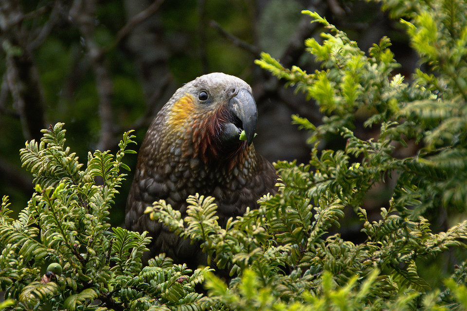

Developed in partnership with [KDV Decision Analysis, LLC](http://www.kdv-decisions.com/)

## Goals and Outcomes

The primary goal of this project was to create a pilot budget allocation
application for the NZ Department of Conservation (DOC) that will allow them to
explore major trade-offs in expected outcomes given a variety of alternative
prioritizations. This pilot application will aid decision-makers in evaluating
the role of resource allocation approaches in the master budgeting process for
the DOC.

The broader outcomes of this project are to better empower decision-makers and
their support staff in DOC to leverage available information on the impacts and
outcomes of different budget allocations across the department, increase budget
allocation transparency during the decision-making process, and better optimize
the assignment of resources to meet the larger objectives of the department.
The hope is that by using this pilot application, the department will more fully
appreciate the benefits of the resource allocation process and leverage those
benefits to make more informed and durable budgetary decisions. In turn, DOC
hopes this leads to increased conservation successes and greater engagement
between New Zealanders, foreign tourists, and partners around New Zealand’s rich
natural heritage and cultural resources.

<!-- https://unsplash.com/photos/AytEEGNnwHc -->
