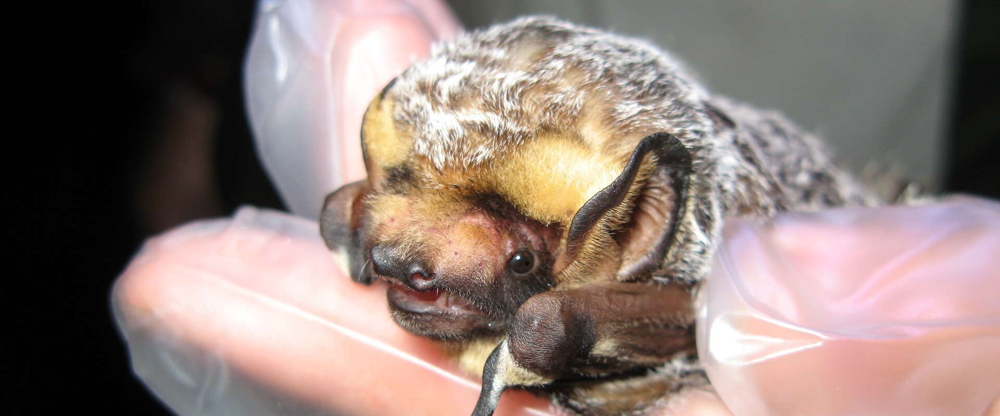

### Bringing together the best available data for hoary bats in California and beyond

Hoary bats are a migratory tree-dwelling bat species that occur across much of
North America. Unfortunately, they have been negatively impacted by renewable
energy development, among other factores. To help support the development of best management plans that reduce the risks of renewable energy development to hoary bat populations in California, the
[California Department of Fish & Wildlife](https://wildlife.ca.gov/) (CDFW)
needs to collate the best available data describing the presence of this species
across California and have a range map that helps identify where this species
may be present at various points in the season.

Because bats are nocturnal and primarily active at night, one of the primary
ways to determine where they occur is to use acousting monitoring. This involves
placing bat detectors in possible bat habitat for one or more nights,
and then processing recorded audio data to identify likely detections of bat species.
The [Bat Acoustic Monitoring Portal](https://batamp.databasin.org/) (BatAMP) in
[Data Basin](https://databasin.org) provides a platform where bat researchers
can then upload records of bat species that they have detected using acoustic monitoring.
I developed the [BatAMP Visualization Tool](https://batamp.org) during my tenure with
the [Conservation Biology Institute](https://consbio.org), in partnership with
the the [USDA Forest Service](https://www.fs.usda.gov/) (USFS), as a way to better
explore and visualize these acoustic records over time and space.

The [North American Bat Monitoring Program](https://www.nabatmonitoring.org/)
(NABat) is a research platform that aggregates observations on bat species using a
variety of methods, including stationary and mobile acoustic detectors, roost
site monitoring, population surveys, and capture records. The goal is to use
standardized data collection methods to create a continental-scale
synthesis of bat occupancy and trends. Historically, NABat acoustic monitoring
data was focused on the summer active period, which meant that acoustic bat
monitoring data for other seasons were typically uploaded to BatAMP instead.

<ImageCredit author="Kathleen Smith, Florida Fish and Wildlife Conservation Commission" url="https://www.flickr.com/photos/myfwcmedia/7157755020/" label="Hoary bat" ></ImageCredit>

In this project, we are collaborating closely with bat scientists in the USFS and
CDFW to aggregate acoustic monitoring data from both BatAMP and NABat into a
standardized dataset that can be used to explore bat occurrence over time across
North America. This will enable them to better understand the seasonal distribution
patterns of hoary bats throughout California and inform the creation of seasonal
habitat maps.

Because the same original data may be uploaded to both BatAMP and NABat, but in
slightly different ways, a significant part of the project involves de-duplicating
records to help avoid double-counting observations. Both data sources are
currently being aggregated together to integrate into the BatAMP Visualization
Tool, which will be a primary tool for members of the project and broader bat
monitoring community to explore these data.

We will also be integrating CDFW's capture records and radio-tagged bat detections
to help supplement the available occurrence data for hoary bats. Whereas acoustic
detections indicate the likely detection of particular species, they are subject
to error. In contrast, both the capture records and radio-tagged bat detections
provide high confidence observations of hoary bats at a particular location and
time.
