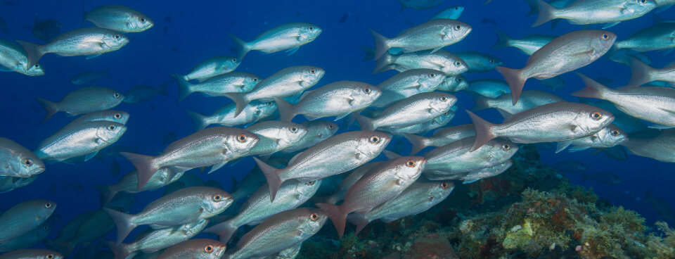

### Synthesizing global marine protection data

Marine protected areas provide critical refugia for many marine species at multiple
points in their life histories. When effectively protected through stringent
regulations and active management to highly restrict extractive activities,
marine protected areas have been shown to help marine species better sustain
fishing and other activities outside their boundaries. Without marine preservation,
these species would be overfished, populations would crash, and marine ecosystems
as well as human populations that depend on them would become imperiled.

The [Marine Conservation Institute](https://marine-conservation.org/)
has been working with partners around the world for the last several years to
develop and apply a rigorous, scientifically-based framework for assessessing marine protection, called
_[The MPA Guide](https://www.science.org/doi/10.1126/science.abf0861)_,
to marine protected areas in order to better characterize the actual amount of
marine protection in place for those areas. These assessments go beyond
legislative designations of protected areas and their associated regulations to
determine which marine protected areas actively managed and protected from a
variety of extractive uses, including fishing and mineral extraction. This makes it possible to identify which marine protected areas are fully protected versus those that are designated as protected areas and yet lack any meaningful protection of marine resources.

The [Marine Protection Atlas](https://mpatlas.org) is the outlet for publishing these assessments of marine protection and is a core part of the Marine Conservation Institute's strategy for monitoring and encouraging marine protection worldwide. It enables members of the marine
conservation community to better access, understand, and communite key statistics
describing marine protection at multiple levels around the world. It also includes data for all marine protected areas
published by the
[World Database on Protected Areas](https://protectedplanet.net)
as a baseline about marine protected areas published by their respective countries.

<ImageCredit author="NOAA" url="https://unsplash.com/photos/vlvc-7nb2U8" />

We have been working with the Marine Conservation Institute since 2020 to
develop, expand, and improve this version of the Marine Protection Atlas. In particular, we developed a data processing pipeline using modern geospatial processing libraries in Python to calculate global and country level protection statistics. We developed a backend API using FastAPI in Python to serve these statistics as well as details for every marine protected area. We developed a user interface using GatsbyJS & React to make it easy to explore marine protection data at multiple levels, both spatially and quantitatively.
