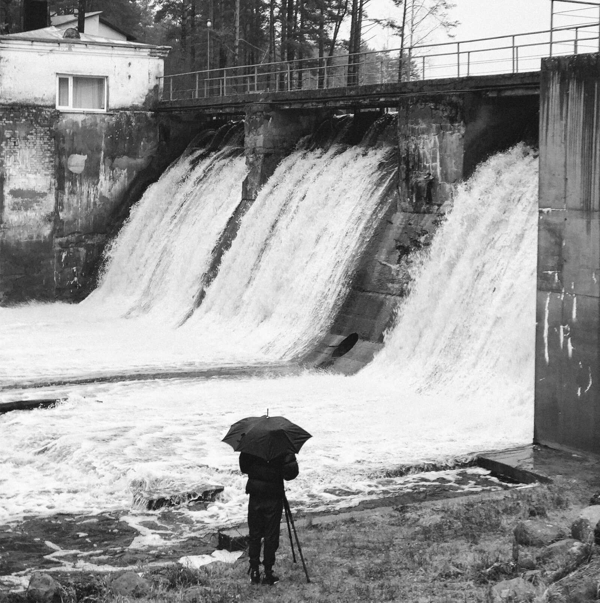

### Increasing aquatic habitat connectivity across the U.S.

Hundreds of years of man-made alterations to the rivers and streams across the
U.S. has resulted in heavily fragmented aquatic habitat. Aquatic barriers
include a wide range of dams, from tiny mill-pond dams to massive hydroelectric
or water management dam systems, as well as culverts and other types of road
crossings over rivers and streams. While some of these barriers may include fish
ladders or other systems that assist migrating fish, most do not. In some cases,
these barriers have fallen into disrepair, and are now a hazard in the aquatic
landscape. There is a strong need to identify the location and characteristics
of aquatic barriers across the U.S. in order to best leverage opportunities for
barrier removal and mitigation, which will benefit both aquatic as well as
human communities.

The [Southeast Aquatic Resources Partnership](https://southeastaquatics.net/) (SARP)
have been leading the development of what is now a nation-wide inventory of
aquatic barriers for several years. They have been instrumental in forming
aquatic connectivity teams in states throughout the Southeast and beyond that
focus on using this inventory to identify aquatic barriers that can be removed
or mitigated. As part of this, they need to find the barriers provide a
reasonable balance between increasing aquatic connectivity while remaining
feasible both in terms of financial cost as well as overall socioeconomic
support. For example, removing a large active hydropower dam could greatly
increase the amount of connected rivers and streams in an area, but may come at
a very steep economic and social cost. In contrast, an aging unused dam created
several decades ago may be both feasible to remove, and contribute a significant
amount of re-connected habitat.

The [National Aquatic Barrier Inventory & Prioritization Tool](https://aquaticbarriers.org)
is the public outlet for this national inventory and is a core component of
SARP's Aquatic Connectivity Program. It was specifically created to enable
users to identify a subset of the inventory for their area of interest, and
calculate their relative ranks in terms of impact to aquatic connectivity and
overall aquatic condition. We originally created this tool in partnership with
SARP focused on their work in the Southeast and have continued to work closely
with them to expand it to cover the entire U.S.

<ImageCredit author="Anton Khmelnitsky" url="https://unsplash.com/photos/Hc4v7w0StzE" label="historic dam" />

Working closely with SARP, We developed a sophisticated data processing pipeline
that integrates aquatic network data from the
[National Hydrography Dataset](https://www.usgs.gov/national-hydrography/nhdplus-high-resolution),
[National Wetlands Inventory](https://www.fws.gov/program/national-wetlands-inventory),
and several other data sources. We developed methods to de-duplicate barriers
that are recorded in the various source datasets aggregated by SARP, even when
their locations or other data do not match. We developed high-performance
routines for snapping the barriers to the aquatic network, and then calculating
associated network topologies and statistics to characterize each barrier's
impact on aquatic connectivity. We also helped develop methods to estimate
dams based on the spatial characteristics of lakes and waterbodies, methods
to associate species in-stream habitat with the aquatic network, and methods
to associate barriers with a wide range of landscape-level contextual information.

Along the way, we iteratively refined the overall data pipeline to better
streamline and optimize the data processing steps. Because of the data volumes
involved, we had to improve the libraries available in the Python geospatial
ecosystem. In particular, we worked with other members of the Python geospatial
community (largely on our own time) to contribute to [Shapely version 2](https://github.com/shapely/shapely), which included massive speedups to the geospatial operations we use in
this project. We also developed what is now the fastest available library
([pyogrio](https://github.com/geopandas/pyogrio)) in Python for reading and
writing GIS files.

These have enabled us to move to a roughly monthly data update and release cycle,
compared to an annual release for a much smaller amount of data when we first
started this project.

The tool has helped users put together grant proposals for barrier removal or
mitigation, and has already been used to identify and help remove barriers that
hadn't even been previously inventoried! Over the long term, this inventory,
tool, and SARP's community of aquatic conservation practioners will be able to
make significant progress toward restoring aquatic connectivity across the U.S.
