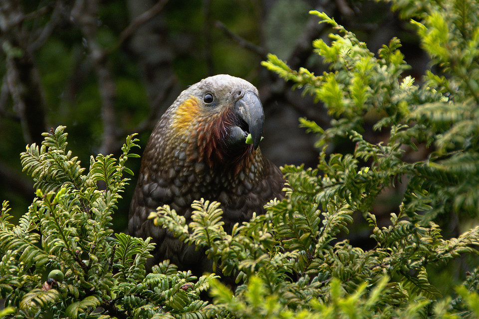

### Improving conservation budgets & outcomes

Let's face it, a budgeting cycle for a large government agency is normally
associated with countless spreadsheets and endless meetings. It is often a slow,
bureaucratic, and hard-to-visualize process. It does not necessarily optimize
for effective, measurable outcomes, nor does it promote collaboration between
different groups within a department to achieve better buy-in and integrated
problem-solving.

The [New Zealand Department of Conservation](https://www.doc.govt.nz/) (DOC) is
actively trying to improve this budgeting process in order to make better
decisions that will impact natural, social, and historical resources in New
Zealand for decades to come. The DOC is currently in the middle of a 10-year
master budgeting process, which involves figuring out how to allocate limited
funds toward:

- preserving rare and sensitive species
- restoring and protecting ecosystems
- reducing the impacts of invasive species
- building effective regional partnerships
- increasing visitor engagment with historical, cultural, and
  natural resources

<ImageCredit author="Tomas Sobek" url="https://unsplash.com/photos/AytEEGNnwHc" label="Kea, New Zealand" />

We started with a rapid prototype developed in 2019 partnership with
[KDV Decision Analysis, LLC](http://www.kdv-decisions.com/), which helped DOC
staff better visualize how they'd like to work through the budget allocation
process using this tool. We have since worked directly with DOC in subsequent
phases to further refine the tool based on their feedback and to keep it in sync
with the DOC's internal organizational changes.

The tool now integrates the latest available budget estimates from the DOC for
each programme within the DOC's internal organizational structure. The allocation
process is centered around "purchasing" a set of outcome plans for each programme,
each of which includes a set of management activities. The tool includes cost-
sharing across management activities that co-occur in space and time when they are
purchased across the range of programmes, which enables the DOC to gain a
somewhat more realistic sense of the overall cost of performing those activities.

The tool has been well-received by senior leaders within the DOC and is being
actively used to further encourage buy-in to the budget allocation approach.
across the DOC as part of the master budgeting process.

_This application is internal to DOC and is not publicly accessible. Please contact us for more information._
