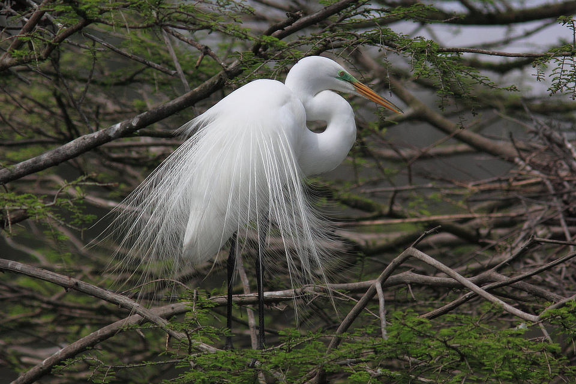

### Improving Access to Conservation Blueprints in the Southeast U.S.

The [Southeast Conservation Adaptation Strategy](http://secassoutheast.org/)
(SECAS) within the [U.S. Fish and Wildlife Service](https://www.fws.gov/)
(USFWS) has been developing and refining landscape-level conservation blueprints
in the Southeast for several years. The
[Southeast Conservation Blueprint](http://secassoutheast.org/blueprint.html)
now covers the full Southeast plus Puerto Rico and the U.S. Virgin Islands using
a unified approach to integrating landscape-level indicators and habitat
connectivity. The Blueprint integrates the current condition of terrestrial,
freshwater, marine, and cross-ecosystem indicators to prioritize the most
important areas for natural and cultural resources.

<ImageCredit author="U.S. Fish and Wildlife Service Southeast Region" url="https://www.flickr.com/photos/usfwssoutheast/7729699178/"
label="Great egret"/>

We have been working closely with the USFWS since 2019 to create online
applications that improve the ability for users to explore, understand, and
apply the Southeast Conservation Blueprint and related landscape-level data.
The [Southeast Conservation Blueprint Explorer](https://apps.fws.gov/southeastblueprint/)
is a feature-rich interactive mapping and data analysis tool that enables users
to explore data summarized at the subwatershed level as well as at the individual
pixel level.

The Explorer includes a novel approach that enables users to filter the
Blueprint and related data layers by the values of the Blueprint or related
data layers. For example, this can be used to identify areas that are of higher
conservation value for forest birds, within large intact habitat cores, and not
likely to urbanize in the near future. Or any other combination of values for
any of the Blueprint's underlying indicators as well as a variety of landscape-level
metrics such as sea-level rise, projected urbanization, and wildfire risk.

The Explorer allows users to create data-rich custom reports for their area of
interest. Users upload a boundary of their area and get back a detailed PDF
that includes a map for the Blueprint, landscape hubs and corridors, every
indicator that is available in that area, and other available landscape-level
datasets. This report functionality in particular has saved USFWS staff large
amounts of time that would otherwise be spent compiling similar information on
request, enabling these staff to focus more on providing value-added interpretation
and user support to enable users to more effectively leverage the Blueprint.
